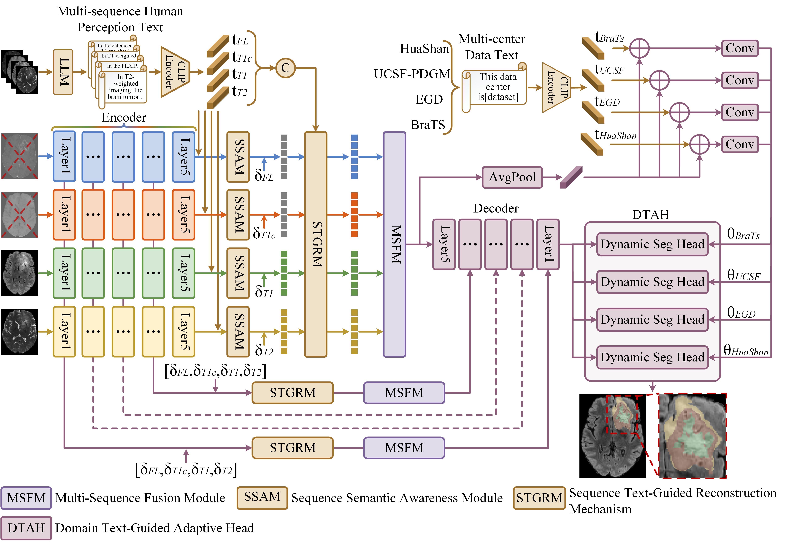

# TGNet
A Text-Guided Framework for Glioma Segmentation in Heterogeneous and Imperfect Multi-Center MRI

**Note:**The experimental code is currently being organized and will be released in the near future.
